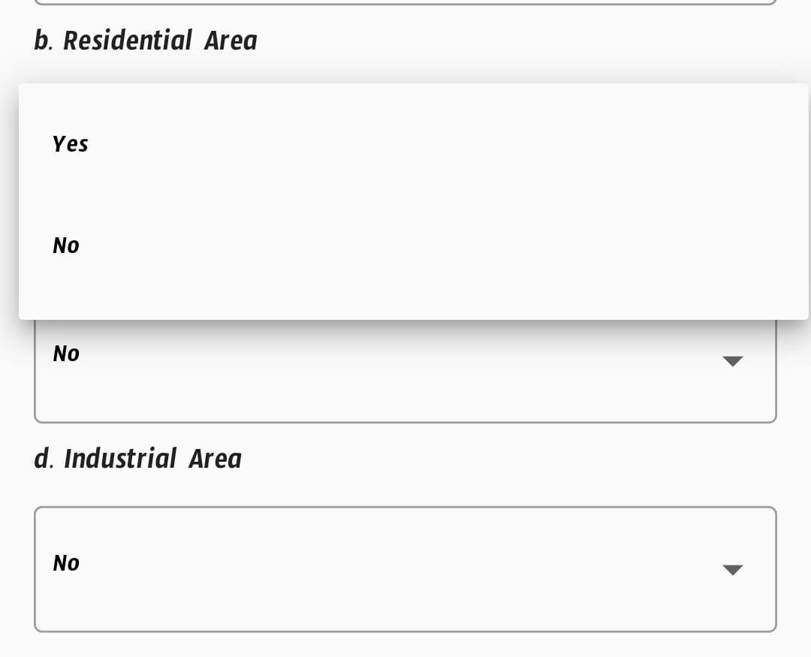

# Drop-Down-Menu [](https://pub.dev/packages/drop_down_list_menu)

A Flutter package that provides a beautiful and customizable drop-down menu.

## Screenshots

<!-- use image in asset folder  -->


## Usage

To use this package, add `drop_down_menu` as a [dependency in your pubspec.yaml file](https://flutter.io/platform-plugins/).

## Example

```dart
import 'package:drop_down_menu/drop_down_menu.dart';

class Example extends StatefulWidget {
  @override
  _ExampleState createState() => _ExampleState();
}


class _ExampleState extends State<Example> {
  List<String> _list = ['One', 'Two', 'Three', 'Four', 'Five'];
  String _selectedItem = 'One';

  @override
  Widget build(BuildContext context) {
    return Scaffold(
      appBar: AppBar(
        title: Text('Drop Down Menu'),
      ),
      body: Center(
        child: DropDownMenu(
          list: _list,
          selectedItem: _selectedItem,
          onItemSelected: (item) {
            setState(() {
              _selectedItem = item;
            });
          },
        ),
      ),
    );
  }
}
```

## Parameters

| Parameter | Type                   | Description                                                |
| --------- | ---------------------- | ---------------------------------------------------------- |
| values    | List<String>           | List of items to be displayed in the drop-down menu.       |
| value     | String                 | The currently selected item.                               |
| onChanged | void Function(String?) | Callback function that is called when an item is selected. |
| title     | String?                | The title of the drop-down menu.                           |
| disable   | bool?                  | If true, the drop-down menu will be disabled.              |

## Github Repository

[Drop-Down-Menu](https://github.com/shubham0809200/Drop-Down-Menu)

## Author

Shubham Kumar - [Github](https://github.com/shubham0809200)
