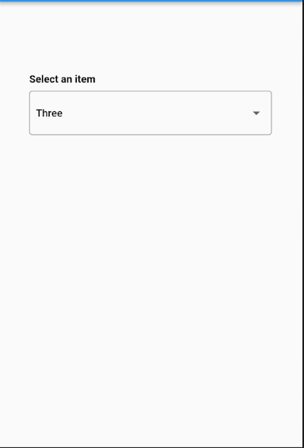
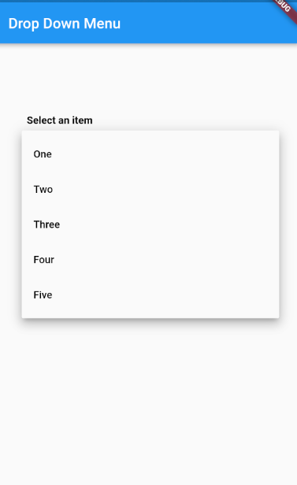

# Drop-Down-Menu [](https://pub.dev/packages/drop_down_list_menu)

The "Drop-Down Menu" package is a Flutter package that provides a user-friendly interface for selecting options from a drop-down menu. This package is designed to be aesthetically pleasing and highly customizable, allowing developers to create a drop-down menu that perfectly fits the look and feel of their app. So, if you want to provide your users with a beautiful and functional drop-down menu, this package is the perfect solution!

## Screenshots

<!-- use image in asset folder  -->
<!-- show two image side by side -->

 

## Usage

To use this package, add `drop_down_menu` as a [dependency in your pubspec.yaml file](https://flutter.io/platform-plugins/).

## Example

```dart
import 'package:drop_down_list_menu/drop_down.dart';

class Example extends StatefulWidget {
  @override
  _ExampleState createState() => _ExampleState();
}


class _ExampleState extends State<Example> {
  List<String> _list = ['One', 'Two', 'Three', 'Four', 'Five'];
  String _selectedItem = 'One';

  @override
  Widget build(BuildContext context) {
    return Scaffold(
      appBar: AppBar(
        title: Text('Drop Down Menu'),
      ),
      body: Center(
        child: DropDownMenu(
          title: 'Select an item',
          enabled: false,
          values: _list,
            value: _selectedItem,
              onChanged: (value) {
              setState(() {
                _selectedItem = value!;
              });
            },
          ),
      ),
    );
  }
}
```

## Parameters

| Parameter | Type                   | Description                                                                    |
| --------- | ---------------------- | ------------------------------------------------------------------------------ |
| values    | List<String>           | List of items to be displayed in the drop-down menu.                           |
| value     | String                 | The currently selected item.                                                   |
| onChanged | void Function(String?) | Callback function that is called when an item is selected.                     |
| title     | String?                | The title of the drop-down menu.                                               |
| enabled   | bool?                  | If false, the drop-down menu will be disabled.                                 |
| themeFont | bool?                  | The font of the drop-down menu and title should be of project theme or default |

## Github Repository

[Drop-Down-Menu](https://github.com/shubham0809200/Drop-Down-Menu)

## Author

Shubham Kumar - [Github](https://github.com/shubham0809200)
